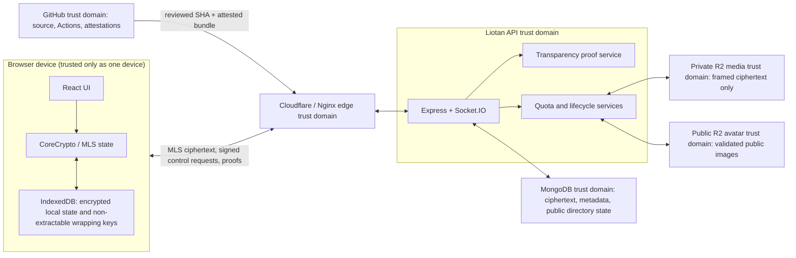

# Crypto v4 post-remediation map

## Trust boundaries



The API, MongoDB, R2, GitHub, and edge are separate trust domains. A compromise
of one is not diagrammed as a compromise of all. The browser device is also not
equivalent to the account: every device has an independent cryptographic
identity and request-auth secret.

## Active protocol components

| Concern | Client | Server/data |
|---|---|---|
| MLS state and envelopes | `client/src/crypto/mlsEngine.jsx`, `client/src/crypto/mls/envelope.jsx` | ciphertext/control validation in `server/controllers/cryptoV4` |
| Device request authentication | `accountKeys.jsx`, `recoveryStore.jsx`, `cryptoApi.jsx` | `deviceAuthProtocol.js`, `cryptoDeviceAuth.js`, `CryptoDevice.js` |
| Directory transparency | `mls/transparency.jsx`, `mls/trust.jsx` | `keyTransparency.js`, transparency models/controller |
| Media encryption | `mls/media.jsx` | pre-body authorization, ciphertext framing, quota/lifecycle services |
| Edit/delete chain | `mls/messageMutations.mjs`, `mlsEngine.jsx` | sequence/cutoff and deletion workflow controls |
| Local private state | encrypted IndexedDB records in `recoveryStore.jsx` | never uploaded as private key material |

## Media framing, AAD, and R2 facts

Each file gets a fresh 32-byte AES-GCM key and an 8-byte random nonce prefix.
The per-chunk IV is `noncePrefix || uint32be(chunkIndex)`. The authenticated
additional data is the canonical JSON array:

```text
[
  "liotan-mls-media-chunk-v1",
  conversationId,
  clientMessageId,
  bindingId,
  chunkIndex,
  chunkCount
]
```

Plaintext file size is **not** in the media AAD. It is private descriptor
metadata inside the MLS message. The R2 object is:

```text
"LIOTANMLS1\0\0" || chunkCiphertext[0] || ... || chunkCiphertext[n-1]
```

The bare R2 object does **not** contain `noncePrefix`, the media key, the
plaintext size, filename, MIME type, dimensions, waveform, or duration.
`noncePrefix` and the key are carried in the encrypted MLS descriptor. The
server stores ciphertext byte count/hash and routing/lifecycle metadata.

## Cryptographic invariant evidence

| # | Invariant | Main automated evidence | Result and boundary |
|---:|---|---|---|
| 1 | Server does not receive new Crypto v4 message plaintext. | crypto static analysis; envelope integration cases | Pass for supported v4 paths. Endpoint metadata remains visible. |
| 2 | Server does not store client private keys. | static forbidden-field checks; data model review | Pass. CoreCrypto/local wrapping keys remain browser-local. |
| 3 | Media is encrypted before upload. | browser MLS media suite; framing gate | Pass; upload accepts framed ciphertext only. |
| 4 | Every media item has a unique key. | mocked randomness/invariant tests | Pass under WebCrypto RNG assumptions. |
| 5 | A nonce is not repeated under one media key. | media chunk IV construction tests | Pass up to the bounded 32-bit chunk index. |
| 6 | Ciphertext is authenticated. | AES-GCM corruption/decrypt tests | Pass; corrupt chunks fail closed. |
| 7 | Descriptor binds conversation/message/binding. | AAD and signed-upload tests | Pass; plaintext size is not falsely claimed as AAD. |
| 8 | Sender cannot be substituted. | authenticated envelope and mutation target tests | Pass for updated clients. |
| 9 | Edit binds the original message. | message mutation v2 unit/integration tests | Pass. |
| 10 | Delete binds the original message. | message mutation v2 unit/integration tests | Pass. |
| 11 | Edit/delete replay is rejected. | replay/stale/fork mutation cases | Pass; delete is terminal. |
| 12 | Epoch rollback is rejected. | MLS rollback/browser cases | Pass within retained local state. |
| 13 | Commit replay is rejected. | MLS commit replay cases | Pass. |
| 14 | Revoked device cannot read future messages. | device removal/epoch integration cases | Pass after removal commit delivery; retained old plaintext remains possible. |
| 15 | New device cannot be added invisibly. | device approval/session and directory event tests | Pass; recovery is a distinct visible device event. |
| 16 | Recovery cannot impersonate an old device. | recovery v2 migration/recovery tests | Pass. |
| 17 | Device approval binds the current session. | signed manifest/request integration cases | Pass. |
| 18 | Legacy writes are impossible. | route tombstone and no-write regression | Pass. |
| 19 | Crypto failure never falls back to plaintext. | crypto static and browser failure cases | Pass. |
| 20 | Upload authorization precedes body consumption. | middleware-order and adversarial integration cases | Pass. |
| 21 | Quota charges actual ciphertext bytes. | reservation settlement/race tests | Pass. |
| 22 | Temporary files are cleaned. | media storage regression | Pass for handled completion/error and startup aging paths. |
| 23 | JWT-expired socket disconnects. | fake-time/integration socket cases | Pass. |
| 24 | Spoofed XFF cannot replace trusted client IP. | proxy trust tests | Pass for the configured exact-CIDR topology. |
| 25 | Avatar race does not leave an unowned object. | CAS loser/orphan reconciliation cases | Pass for new writes; production history needs read-only count. |
| 26 | Production bundle binds one exact commit. | source revision, deployment, archive and installer regressions | Pass locally; GitHub attestation is verified during authorized deployment. |
| 27 | Directory rollback/fork is detected within the implemented model. | checkpoint signature/inclusion/consistency/gossip tests | Pass; no independent external witness exists. |

## Honest security display inputs

The client now has distinct facts from which UI can derive status:

- device identity and approval state;
- directory proof/checkpoint verification and continuity;
- MLS conversation/epoch state;
- safety-number binding;
- local recovery/device credential version;
- security events for device addition/recovery/revocation.

No single green lock should collapse these independent claims into “everything
is secure.” Directory proof success does not prove human identity, and a safety
number does not provide hardware-backed storage.
