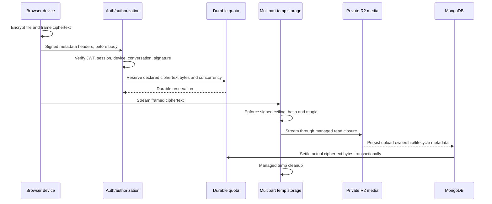

# Media quota and storage architecture

## Request order



Authentication, device proof, conversation authorization, declared-size
validation and durable reservation occur before Multer consumes the body.

## Quota dimensions

Every transfer is charged to:

- global;
- account;
- device;
- session;
- hashed client IP.

For upload and download, durable windows enforce bytes and requests per minute,
hour and day. Durable state also enforces active uploads/downloads, stored bytes
and object counts. Defaults are centralized in
`server/services/mediaQuota.js`; production overrides use the corresponding
`MEDIA_QUOTA_<SCOPE>_...` variables and must remain positive integers.

Reservations expire after 15 minutes. Settlement uses actual ciphertext bytes,
not the client’s plaintext size. Download ranges are capped to 8 MiB per
response, so range fragmentation cannot bypass egress accounting.

## Storage lifecycle

`AttachmentUpload.quotaStorageState` has an explicit lifecycle:

```text
untracked -> temporary -> persistent -> released
```

- `temporary` counts uploaded bytes while the message is not durably attached;
- `persistent` counts owned live storage;
- `released` is terminal and decrements the prior storage state exactly once.

The transition and counter deltas occur transactionally with the upload record.
`MediaTransferReservation` prevents duplicate settlement. Quota scope IDs are
HMAC-derived, so reports do not expose account/session/IP identifiers.

## R2 and local temporary data

- MLS media uses a private R2 bucket and ciphertext-only object format.
- Avatar images use a separate public bucket and separate credentials.
- Upload code receives only `openReadStream()` and
  `removeManagedFile()` closures, never an attacker-controlled filesystem path.
- Temporary filenames are server-generated, exclusive-created and mode `0600`.
- Stream errors, rejection and normal completion call managed cleanup.
- Startup removes only old files matching the exact managed filename pattern.
- R2 delete treats `404` as idempotent success.

## Reconciliation

`migrateMediaQuotaLifecycle.js` (`50.3.0-media-quota-lifecycle`) backfills
lifecycle state with durable leases/checkpoints and verifies totals.
`reconcileMediaQuota.js` is dry-run by default and reports only aggregates; its
apply mode requires an exact confirmation and production maintenance mode.

Avatar reconciliation is separately dry-run by default through
`reconcileAvatarStorage.js`. It compares owned avatar state with bucket state
and deletes only with a second explicit confirmation.

## Operational invariants

- do not raise a per-request limit as a substitute for aggregate quotas;
- do not authorize inside or after a Multer handler;
- do not infer plaintext size from ciphertext bytes;
- do not place media keys or nonce prefixes in R2 object framing;
- do not merge avatar and private-media buckets or credentials;
- do not bypass lifecycle transitions with direct model updates;
- run read-only inventory/reconciliation before any production apply.
